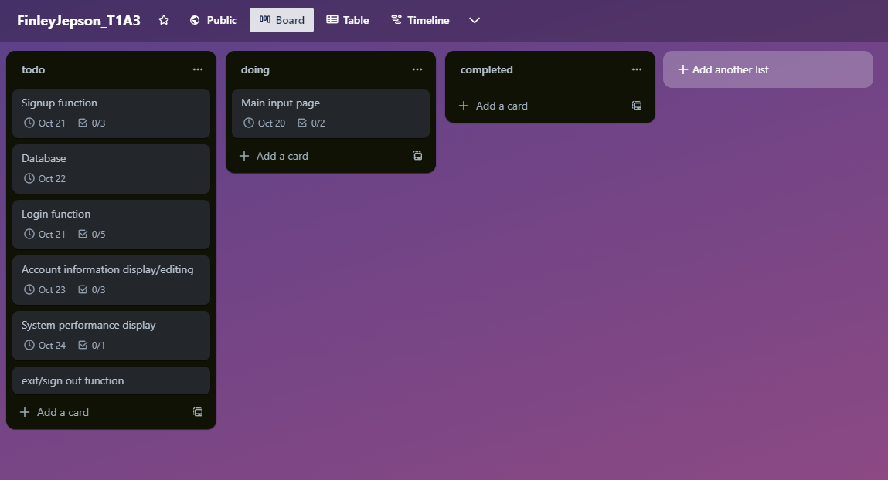
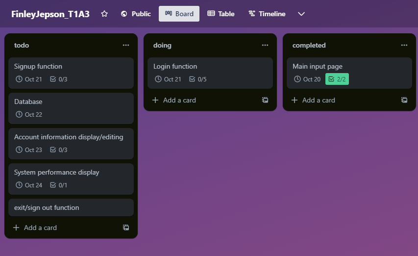
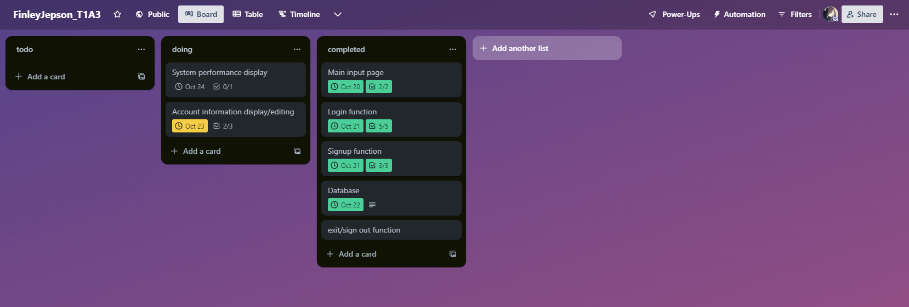
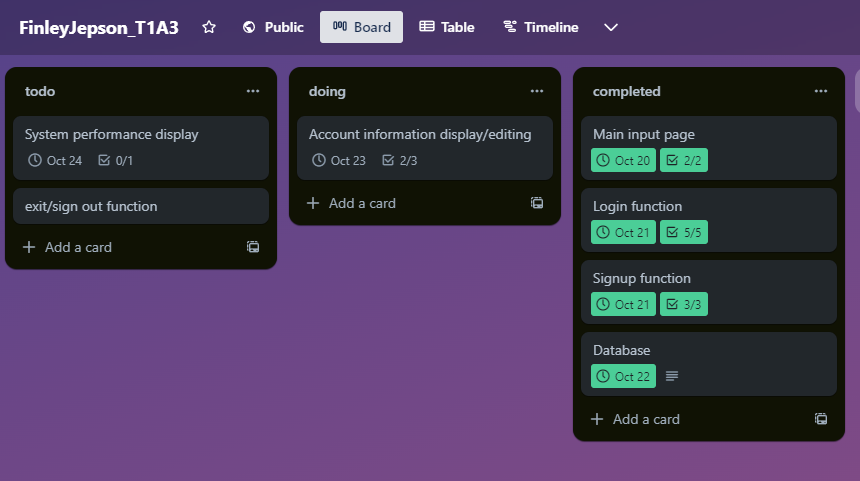

# FinleyJepson_T1A3 Documentation

# Table of Contents
1. [FinleyJepson_T1A3 Documentation](#finleyjepsont1a3-documentation)
2. [Introduction](#introduction)
3. [References and Attribution](#references-and-attribution)
4. [Source Control Repository](#source-control-repository)
5. [Code Style Guide](#code-style-guide)
6. [Features](#features)
7. [Implementation Plan](#implementation-plan)
8. [Help Documentation](#help-documentation)

## Introduction
This repository is a program developed to serve as a simple login and registration system. This application uses a SQLite database to manage user credentials and offers a series of user-centric functionalities.

## References and Attribution
All references used in this documentation are provided with direct links to the source for full attribution. Notable references include:
- [PEP 8 styling guide](https://peps.python.org/pep-0008/)
- [Python Minimum Hardware Requirements](https://support.enthought.com/hc/en-us/articles/204273874-Enthought-Python-Minimum-Hardware-Requirements)

## Source Control Repository
The entire codebase for this application is stored and version-controlled on GitHub. You can access the repository here:
- [Repository Link](https://github.com/finleyjepson/FinleyJepson_T1A3)

## Code Style Guide
The source code for FinleyJepson_T1A3 adheres to the PEP 8 styling convention for Python, ensuring a clean and uniform coding style. Detailed guidelines for this styling convention can be found at the [PEP 8 styling guide](https://peps.python.org/pep-0008/).

## Features

### Application Features and Implementation

#### 1. **Login Function**
This feature permits users to securely log in by comparing their provided password against the one stored in the database. Here's a breakdown:

- The username is inputted and checked against the SQLite database `credentials.db`.
  
- The password input is hidden for security reasons using `getpass`.
  
- To enhance security, the password is hashed using MD5 before it's compared to the database's hashed password.
  
- The function also has a security measure against password brute-forcing: after 3 unsuccessful attempts, the user is temporarily blocked for 1 minute.
  
- Successful login directs the user to a welcoming dashboard, while an invalid username or password prompts for another attempt or exit.

#### 2. **Register Function**
This aids users in creating a new account with the application. 

- The user is prompted for a username, password, and password confirmation.
  
- The passwords should match, and to ensure a strong password, there are constraints:
  - At least 8 characters in length.
  - At least one uppercase letter.
  - At least one digit.
  
- The password is hashed using MD5 for storage security.
  
- If the provided username already exists in the database, the user is informed and asked to try a different username.

#### 3. **Editing/Adding additional account information**
After successful login, users are directed to a dashboard where they can:

- **Display Account Information**: The user can see details such as ID, username, first name, last name, email, and phone number.

- **Edit Account Information**: Users can modify details including:
  - First Name
  - Last Name
  - Email: The email is validated to ensure it's a legitimate format.
  - Phone: The phone number must be 10 digits long.
  
#### 4. **System Performance Monitor**
This feature provides a real-time monitor for CPU and memory usage:

- Uses the `curses` library to create an interactive terminal UI.
  
- It displays the current CPU percentage usage and memory usage in real-time, updated every second.
  
- The function leverages the `psutil` library to get the CPU and memory statistics.
  
- Pressing any key will bring the user back to the main menu.

### Other Notable Implementation Details

- **Database Interaction**: The SQLite database named `credentials.db` is used to store and retrieve user credentials and information. 

- **Error Handling**: Throughout the application, various types of error handling mechanisms are present. Whether it's database-related errors or general exceptions, they're caught and displayed to the user.

- **Main Loop**: The application starts with a main menu loop where the user can choose to login, register, or exit the application. Proper input validation ensures the user's input matches the available options.

- **End of Program**: When the user chooses to exit the application or if any unforeseen error occurs, a goodbye message is displayed, and the program ends gracefully.

## Implementation Plan

### Project Management Platform:
The implementation planning and tracking are managed using Trello. A detailed implementation plan, along with checklists and time indicators for each feature, is structured on the platform.

[Link to Trello Board](https://trello.com/b/hAej7lpq/finleyjepsont1a3)

```

```

Screenshot #1

Screenshot #2

Screenshot #3

Screenshot #4


## Help Documentation

### Installation:
1. Clone the repository or download the `main.py` file.
2. Install the required dependencies using pip.
3. Run the `main.py` file in a Python environment.

### Dependencies:
The program necessitates the following Python packages:

- `getpass`
- `hashlib`
- `sqlite3`
- `time`
- `psutil`
- `curses`
- `re`
- `email_validator`

Use the following pip command to install these:
```
pip install getpass hashlib sqlite3 time psutil curses re email_validator
```

### System & Hardware Requirements:
- Modern OS: Windows 7/10, Mac OS X 10.11 (64-bit), Linux RHEL 6/7 (64-bit).
- x86 64-bit CPU (Intel/AMD). ARM not supported.
- 4 GB RAM.
- 5 GB free disk space.

### Usage:
Run the `main.py` file in a standalone terminal. Follow on-screen prompts to login/register and use other functionalities.